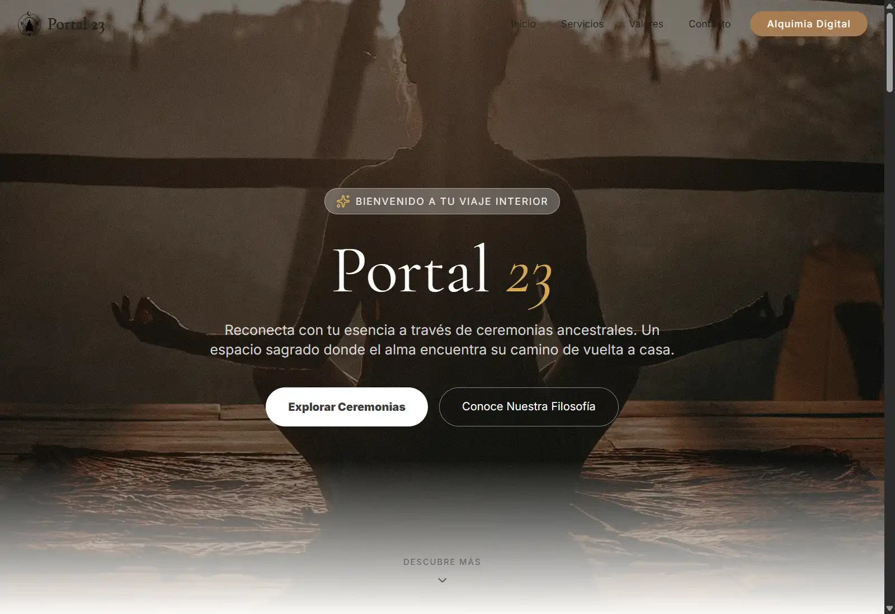
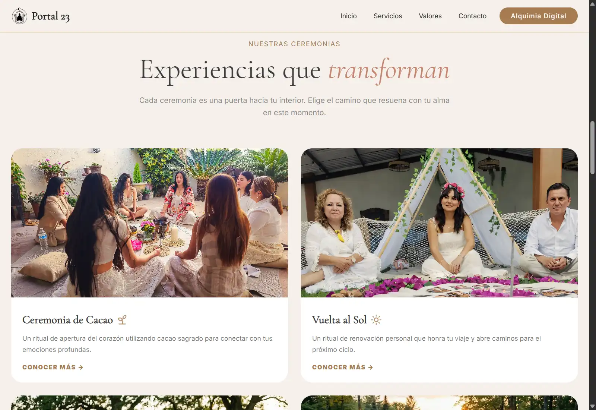
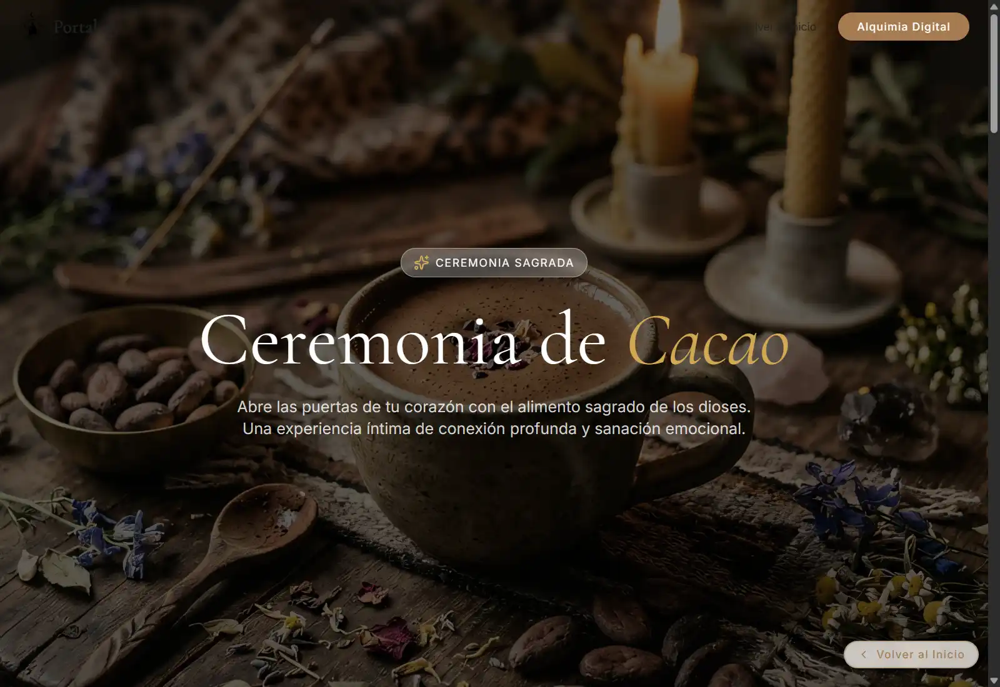
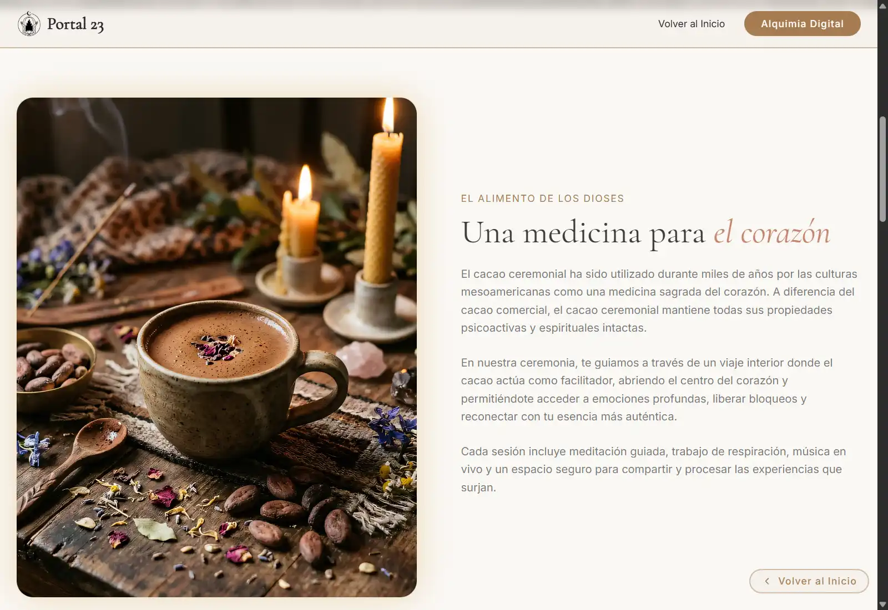
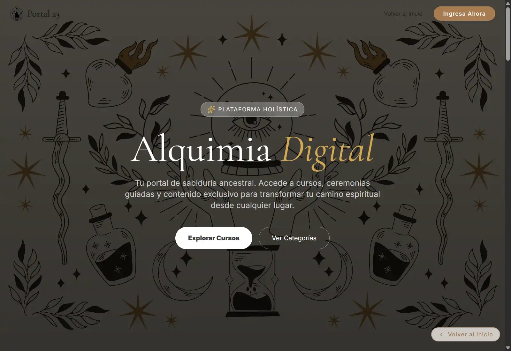
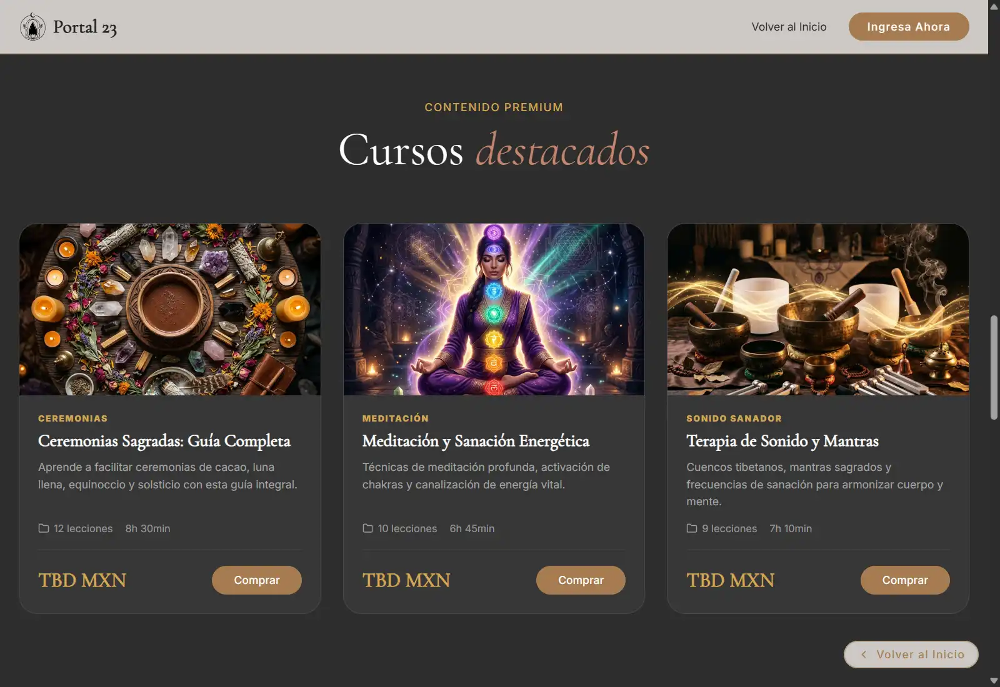
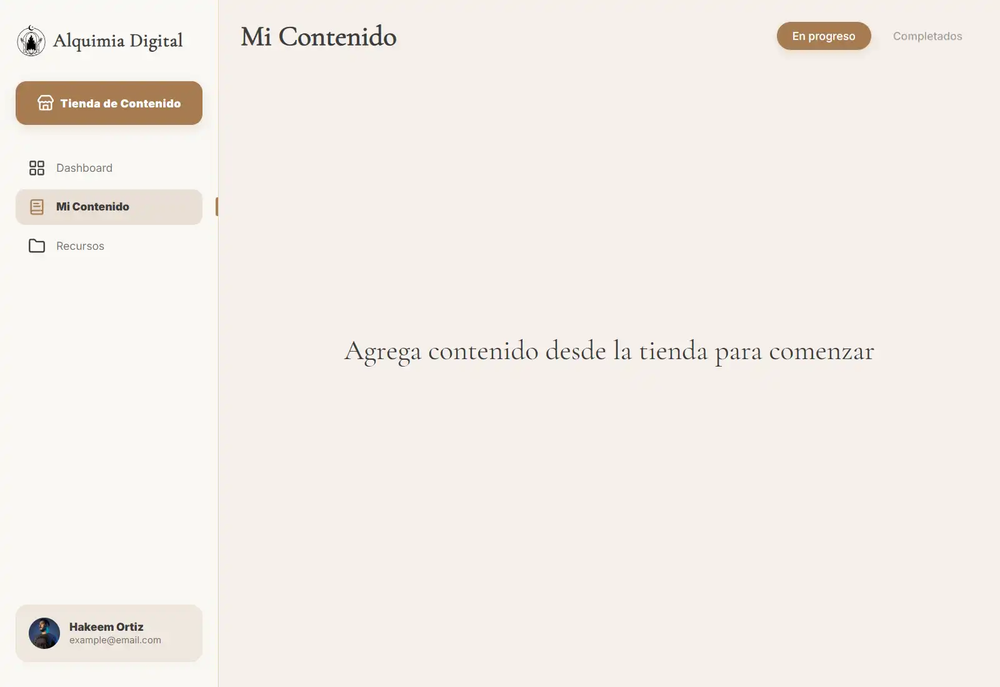
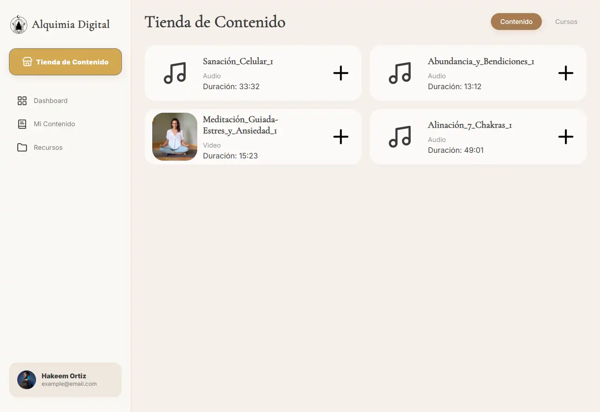
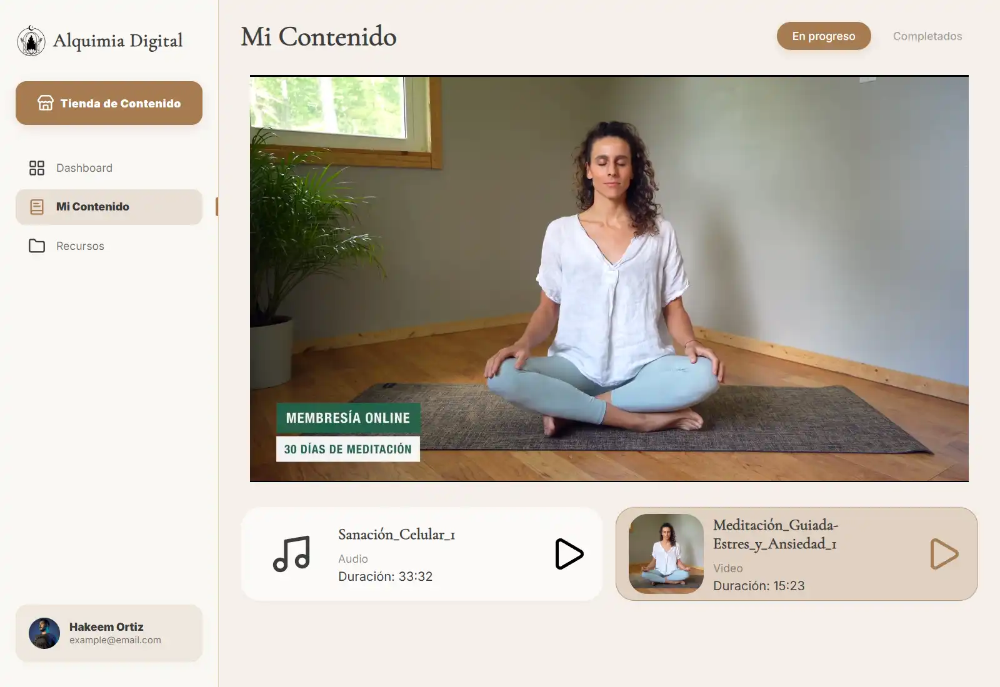

# Portal 23 - Frontend

Repositorio para el FrontEnd de: 
- Una página web para "PORTAL 23" con información sobre ceremonias holísticas presenciales (ruta "localhost:3210/").
- Una aplicación de cursos online para convertirte en maestro de Ceremonias Hólisticas "Alquimia Digital" (ruta "localhost:3210/app/alquimia-digital").


## Prueba la App Ahora (Pasos a Seguir)

1. Ve al codigo del repositorio en GitHub: https://github.com/HakeemZitroFx/portal23-frontend
2. En la barra lateral derecha, ve a "Deployments".
3. Haz clic en el enlace de la última implementación.
4. La app se abrira en blanco pero no te preocupes, es solo un problema de despliegue con GitHub.
5. Navega con el navbar (El boton de "Alquimia Digital" llevará primero a la web, luego al login de la app).


## Tecnologías Utilizadas

- **Vite** - Build tool
- **HTML / CSS / JS** - Lenguajes de programación
- **React / JSX** - Framework de UI


## Características del Proyecto

- **Componentes Funcionales**
- **React Hooks** (useState / useEffect / useContext / useRef)
- **React Router** (Routes / Route / Navigate / Link / useNavigate / useLocation)
- **Funciones Asíncronas** para solicitudes HTTP a REST API
- **Variables de Entorno** para credenciales de Mux (Solo lectura)


## Notas de Desarrollo

- Todos los estilos están implementados con Modulos CSS en la carpeta `blocks/`.
- El frontend se comunica con la API de Mux a través de `src/utils/Api.js`.
- El enrutamiento se maneja con `react-router-dom`.
- La aplicación utiliza `react-mux-player` para la reproducción de videos.
- La aplicación mejorará bastante una vez se cree el backend con bases de datos y autenticación.


## Estructura del Proyecto

```
src/
├── components/                 # Componentes reutilizables
│   ├── Header/                 # Cabecera de la web
│   ├── Footer/                 # Pie de página de la web
│   ├── Main/                   # Contenido principal
│   │   ├── Pages/              # Páginas de la web
│   │   ├── AlquimiaDigital/    # Páginas de la aplicación
│   │   └── ...
│   └── ...
├── utils/                      # Utilidades y API
├── App.jsx                     # Componente principal
└── main.jsx                    # Punto de entrada
```


## Vista Previa de la Aplicación Web










